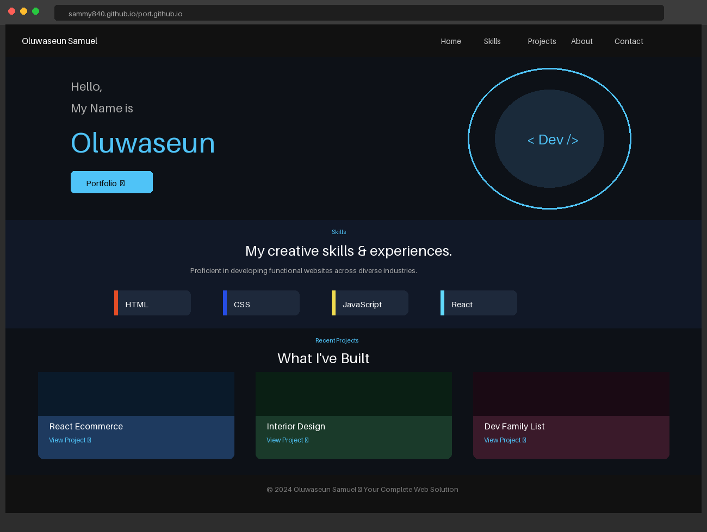

# 🌐 Oluwaseun Samuel — Personal Portfolio Website

> A clean, responsive personal portfolio website built with HTML, CSS & JavaScript to showcase my skills, projects, and contact information as a Frontend Developer.

🔗 **Live Demo:** [sammy840.github.io/port.github.io](https://sammy840.github.io/port.github.io/)

---

## 📸 Preview



---

## ✨ Features

- **Responsive Design** — fully optimized for mobile, tablet, and desktop screens
- **Single-Page Layout** — smooth anchor-based navigation across all sections
- **Skills Section** — highlights core frontend technologies with visual indicators
- **Projects Showcase** — three featured projects with live demo links and descriptions
- **About Me** — professional bio with a downloadable CV
- **Contact Section** — phone, email, and physical address at a glance
- **Social Links** — direct links to Facebook, Twitter/X, and LinkedIn in the footer

---

## 🛠️ Built With


---

## 📁 Project Structure

```
port.github.io/
├── index.html          # Main HTML structure and content
├── style.css           # All custom styles and responsive layouts
├── app.js              # JavaScript for interactivity
├── Oluwaseun_cv.pdf    # Downloadable CV/Resume
└── img/                # Project screenshots and profile photo
    ├── pp.jpg
    ├── react-ecoms.png
    ├── pros.png
    └── fams.png
```

---

## 🚀 Getting Started

To view this project locally:

1. **Clone the repository**
   ```bash
   git clone https://github.com/Sammy840/port.github.io.git
   ```

2. **Navigate into the project folder**
   ```bash
   cd port.github.io
   ```

3. **Open `index.html` in your browser**

   Simply double-click the `index.html` file, or run a local server:
   ```bash
   # Using VS Code Live Server (recommended)
   # Right-click index.html → "Open with Live Server"

   # Or using Python
   python3 -m http.server 3000
   ```

> No build tools, frameworks, or package managers required. Opens straight in the browser.

---

## 📌 Featured Projects

| # | Project | Description | Tech | Live |
|---|---------|-------------|------|------|
| 1 | **React Ecommerce Website** | Responsive shopping site with reusable components, styled-components & react-router | React, JSX | [View →](https://react-ecom-shop.netlify.app/) |
| 2 | **Interior Design Website** | Fully responsive 4-section interior decoration site | HTML, CSS, JS | [View →](https://sammy840.github.io/prodesign.github.io/) |
| 3 | **Dev Family List** | CRUD family register app with login authentication | HTML, CSS, JS | [View →](https://sammy840.github.io/fam.github.io/) |

---

## 📬 Contact

| Channel | Details |
|---------|---------|
| 📧 Email | samoluwaseun2016@gmail.com |
| 📞 Phone | +234 706 9191 369 |
| 📍 Location | Benin City, Edo State, Nigeria |
| 💼 LinkedIn | [oluwaseun-ogunbayo](https://www.linkedin.com/in/oluwaseun-ogunbayo-7b7973197) |
| 🐦 Twitter/X | [@webbidox](https://twitter.com/webbidox/) |
| 📘 Facebook | [ogunbayo.samuel1](https://web.facebook.com/ogunbayo.samuel1/) |

---

## 📄 License

This project is open source and available under the [MIT License](LICENSE).

---

<p align="center">
  <em>"Building world-class websites, one line of code at a time."</em><br/>
  <strong>— Oluwaseun Samuel</strong>
</p>
